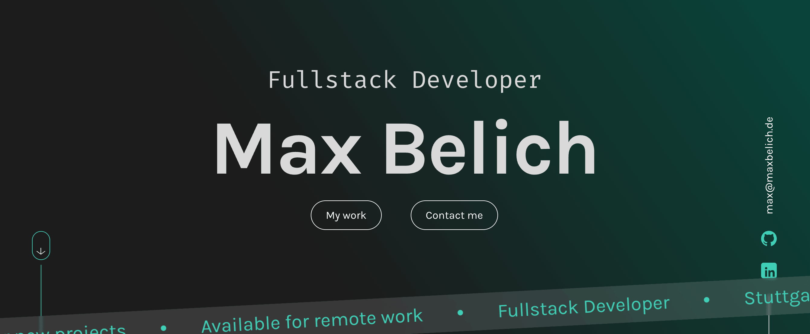

# Max Belich - Portfolio


Personal portfolio website showcasing my projects, skills and experience as a developer.

**Live:** [maxbelich.de](https://maxbelich.de/)



## About

This portfolio is built with Angular and TypeScript and serves as the central showcase for my development projects.

The application uses standalone Angular components and signals, supports English and German, includes a server-side contact form and is automatically deployed to my Hetzner webspace through GitHub Actions.

## Features

- Responsive portfolio for desktop, tablet and mobile
- English and German language support with ngx-translate
- Project showcase with live demos and GitHub links
- Skills and technology overview
- Testimonials section
- PHP contact form backend
- Legal notice and privacy policy
- Unit tests with Vitest
- Automated deployment to Hetzner via GitHub Actions and SFTP

## Tech Stack

- **Angular 22** - standalone components and signals
- **TypeScript**
- **SCSS**
- **ngx-translate** - English / German internationalization
- **PHP** - server-side contact form
- **GitHub Actions** - automated deployment
- **Hetzner** - production hosting

## Getting Started

Clone the repository:

```bash
git clone https://github.com/maxbelich/Portfolio-Max-Belich.git
```

Open the project directory:

```bash
cd Portfolio-Max-Belich
```

Install the dependencies:

```bash
npm install
```

Start the local development server:

```bash
npm start
```

Then open:

```text
http://localhost:4200
```

## Project Structure

```text
src/app/
├── layout/        # Header and footer
├── pages/         # Home, legal notice and privacy policy
└── shared/        # Components, data, interfaces and services
```

Public assets, translations and images are stored inside:

```text
public/
```

## Deployment

Pushes to `main` are deployed automatically through GitHub Actions.

The workflow builds the Angular application and uploads the production files to the Hetzner webspace via SFTP.

## Author

**Max Belich**

[Portfolio](https://maxbelich.de/) · [LinkedIn](https://www.linkedin.com/in/max-belich-6b844b424/)

## License

© 2026 Max Belich. All rights reserved.
